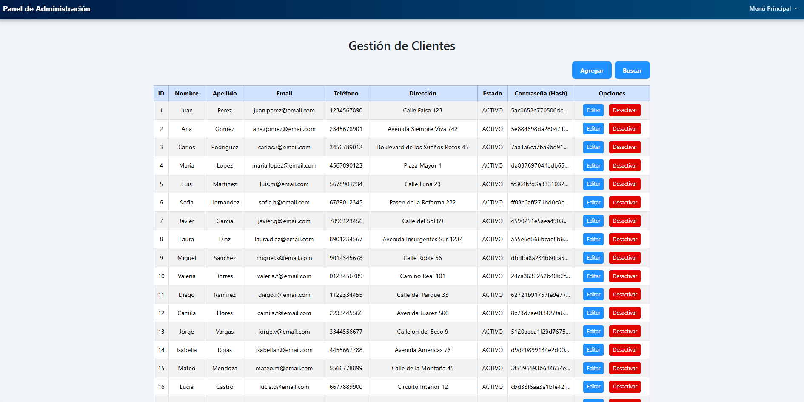

# KINCAPS - Tienda Virtual de Gorras

KINCAPS es una tienda virtual que ofrece un catálogo amplio de gorras de estilos variados, como urbanas y deportivas, con funciones de filtrado por categorías. Integra un diseño responsivo, pagos seguros y envíos rápidos para una experiencia de compra accesible desde la web 

## Tabla de Contenidos

1. [Características Principales](#caracteristicas-principales)
2. [Primeros Pasos (Instalación)](#primeros-pasos-instalacion)
    - [Prerrequisitos](#prerrequisitos)
    - [Configuración del Proyecto](#configuracion-del-proyecto)
    - [Configuración de la Base de Datos](#configuracion-de-la-base-de-datos)
3. [Cómo Usar la Aplicación](#como-usar-la-aplicacion)
    - [Flujo del Cliente](#flujo-del-cliente)
    - [Flujo del Administrador](#flujo-del-administrador)
4. [Tecnologías Utilizadas](#tecnologias-utilizadas)

## Características Principales

-   **Autenticación de Usuarios:** Sistema de registro e inicio de sesión seguro para clientes y administradores.
-   **Utilización de Cookies:** Se utilizan cookies en el inicio de sesión para evitar iniciar sesión cada vez. 
-   **Catálogo de Productos:** Visualización de productos con filtros dinámicos por precio y categoría.
-   **Carrito de Compras Interactivo:** Añade, elimina y actualiza la cantidad de productos en un carrito lateral sin recargar la página.
-   **Flujo de Pago (Checkout):** Página de pago con resumen de pedido, formulario de datos y selección de método de pago (Tarjeta o Contra Entrega).
-   **Detección de Tarjetas:** La interfaz detecta automáticamente el tipo de tarjeta (Visa, Mastercard, Amex) y muestra el ícono correspondiente.
-   **Historial de Compras:** Los usuarios pueden ver un registro de todos sus pedidos anteriores.
-   **Panel de Administración (CRUD):** Interfaz separada para que los administradores gestionen todas las entidades de la base de datos (Clientes, Productos, Proveedores, etc.).
-   **Gestión de Stock:** El stock se descuenta automáticamente después de una compra exitosa y la interfaz de usuario previene la sobreventa.

## Primeros Pasos (Instalación)

Sigue estos pasos para poner en marcha el proyecto en tu entorno local.

### Prerrequisitos

-   **JDK 8** (obligatorio).
-   Un servidor de aplicaciones compatible con Servlets, es recomendado **GlassFish 5.0**.
-   **MySQL Server** para la base de datos.
-   Un IDE de Java como **NetBeans**, **IntelliJ IDEA** o **Eclipse**.

### Configuración del Proyecto

1.  Clona o descarga este repositorio.
2.  Abre el proyecto en tu IDE de preferencia.
3.  **Configura la conexión a la base de datos:** Ve al archivo de guía para configurar tu pool JDBC **KinCaps JDBC Pool Creation** úbicada en `C:\Repositorios\KinCaps\Database` y modifica la primera instrucción `--property user=quintom:password=admin` con tus credenciales de MySQL.
4.  Configura tu servidor de aplicaciones en el IDE y despliega el proyecto KINCAPS.

### Configuración de la Base de Datos

Es crucial ejecutar los scripts de la base de datos en el orden correcto para asegurar la integridad de los datos.

1.  Abre tu cliente de MySQL (Workbench, DBeaver, etc.).
2.  Ejecuta los siguientes scripts en este orden exacto:
    1.  `DB_KinCaps.sql` - Crea la estructura de tablas.
    2.  `SP_KinCaps.sql` - Crea los procedimientos almacenados (si aplica).
    3.  `ExampleData_KinCaps.sql` - Inserta datos de ejemplo para pruebas.

## Cómo Usar la Aplicación

### Flujo del Cliente

#### 1. Registro e Inicio de Sesión

Al iniciar la aplicación, el usuario es dirigido a la página de **Login**.
-   Si ya tiene una cuenta, puede ingresar su correo y contraseña.
-   Si es un usuario nuevo, puede hacer clic en el enlace "¿No tienes una cuenta?, Regístrate" para ir al formulario de registro.

-   El inicio de sesión contiene un apartado para **recordar las credenciales**, esta función utiliza las cookies del navegador para poder recordar el usuario sin tener que volver a iniciar sesión cada vez.

#### 2. Menú Principal

Una vez iniciada la sesión, el usuario llega al Menú Principal, que presenta:
-   Un header con un cálido mensaje de bienvenida.
-   Una barra de características (Catálogo, Misión y visión, etc).
-   Una sección de **Gorras Destacadas**, que muestra dinámicamente las 4 gorras más vendidas. Si no hay ventas, muestra 4 gorras aleatorias.

#### 3. Catálogo y Detalles del Producto

-   Desde el menú o la barra de navegación, el usuario puede acceder al **Catálogo**.
-   Aquí puede ver todas las gorras y usar los filtros del lado izquierdo para buscar por precio o categoría.
-   Al hacer clic en "Ver más", se navega a la página de **Detalles del Producto**. Esta página muestra el stock disponible real (descontando lo que el usuario ya tiene en su carrito) y un *spinner* de cantidad que no permite agregar más del stock disponible.

#### 4. Carrito y Proceso de Pago

-   Desde la página de detalles, el usuario puede agregar productos al carrito.
-   El **Carrito de Compras** es un modal lateral que se actualiza dinámicamente. Muestra los productos, cantidades y el total. El usuario puede eliminar items o ajustar cantidades desde aquí.
-   Al hacer clic en "Ir a Pagar", se le lleva a la página de **Checkout**. Aquí se muestra un resumen del pedido y un formulario para ingresar la dirección de envío y seleccionar el método de pago, con detección automática del tipo de tarjeta.

### Flujo del Administrador

#### 1. Inicio de Sesión de Administrador

Para acceder al panel de administración, se debe iniciar sesión con credenciales de empleado. Se han proporcionado datos de ejemplo para un administrador:

-   **Correo:** `admin@kincaps.com`
-   **Contraseña:** `admin123`

Al iniciar sesión con estas credenciales, el sistema redirige automáticamente al panel de administración.

#### 2. Panel de Administración

El panel es un menú centralizado que permite la gestión completa (CRUD - Crear, Leer, Actualizar, Eliminar) de **todas las tablas** de la base de datos:

-   **Gestionar Proveedores**
-   **Gestionar Clientes**
-   **Gestionar Empleados**
-   **Gestionar Productos (Gorras)**
-   **Ver Carritos**
-   **Gestionar Facturas**
-   Y más...

## Tecnologías Utilizadas

-   **Backend:** Java, Servlets
-   **Frontend:** JSP, JSTL, HTML5, CSS3, JavaScript (Fetch API)
-   **Base de Datos:** MySQL
-   **ORM:** JPA (Hibernate)
-   **Frameworks y Librerías:** Bootstrap 5, Google Gson
-   **Servidor:** GlassFish 5.0
